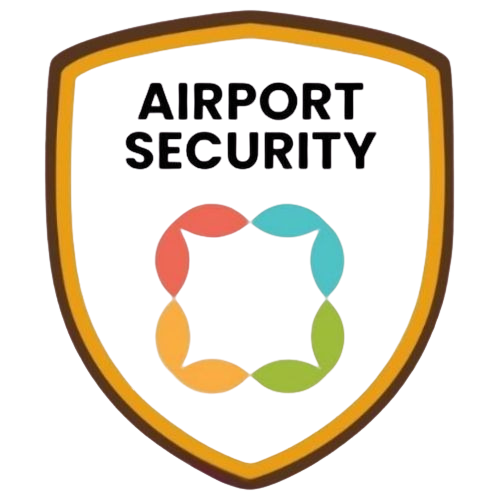

<p align="center">
  
</p>

<h1 align="center">AVSEC - Aviation Security System</h1>

<p align="center">
  <strong>Sistem Keamanan Penerbangan Terpadu untuk Bandara Angkasa Pura</strong><br>
  Dibangun menggunakan Laravel 12 — cepat, aman, modern.
</p>

<p align="center">
  <a href="https://laravel.com"></a>
  <a href="#"></a>
  <a href="#"></a>
</p>

---

## ✈️ Tentang AVSEC

**AVSEC (Aviation Security)** adalah aplikasi manajemen keamanan bandara yang dirancang untuk mendukung operasional keamanan di lingkungan Bandara **Angkasa Pura**. Aplikasi ini memudahkan petugas dalam:

- Pencatatan dan pelaporan insiden keamanan
- Manajemen personel dan shift petugas AVSEC
- Monitoring zona sensitif dan area terbatas
- Sistem notifikasi dan eskalasi real-time
- Laporan bulanan dan statistik keamanan

AVSEC dirancang dengan fokus pada **keamanan**, **kecepatan**, dan **aksesibilitas**.

---

## 🚀 Fitur Unggulan

- 🔐 **Autentikasi & Role-based Access** — Admin, Supervisor, Petugas
- 📋 **Pelaporan Insiden** — Formulir laporan dinamis dan terstandarisasi
- 🧑‍✈️ **Manajemen Personel** — Data personel, jadwal, dan tugas
- 🛰️ **Monitoring Zona** — Sistem berbasis lokasi (zona) untuk keamanan area terbatas
- 📊 **Dashboard Real-Time** — Statistik harian, mingguan, bulanan
- 📎 **Dokumentasi & Log** — Penyimpanan dokumen penting dan histori tindakan
- 🔔 **Sistem Notifikasi** — Push notification & email untuk kasus prioritas

---

## 🧰 Teknologi yang Digunakan

- **Laravel 12** - Web Framework (PHP)
- **MySQL / PostgreSQL** - Database
- **Livewire / Inertia / Vue.js** (Opsional) - Interaktivitas UI
- **Bootstrap / Tailwind** - UI Framework
- **Spatie Permission** - Manajemen Hak Akses
- **Laravel Sanctum / Passport** - API Authentication (jika diperlukan)
- **Chart.js / ApexCharts** - Visualisasi Data

---

## ⚙️ Instalasi Lokal

1. **Clone Repository**
   ```bash
   git clone https://github.com/ReskySurya/Avsec-app/avsec.git
   cd avsec
   ```

2. **Install Dependency**
   ```bash
   composer install
   npm install && npm run dev
   ```

3. **Environment Setup**
   ```bash
   cp .env.example .env
   php artisan key:generate
   ```

4. **Migrasi dan Seeding**
   ```bash
   php artisan migrate --seed
   ```

5. **Jalankan Server**
   ```bash
   php artisan serve
   ```

---

## 📚 Dokumentasi

Untuk dokumentasi lengkap mengenai struktur proyek, flow sistem, dan petunjuk penggunaan, silakan kunjungi:  
📖 `docs/` folder atau [Wiki Proyek GitHub](#)

---

## 🤝 Kontribusi

Kontribusi sangat terbuka! Jika Anda tertarik membantu pengembangan sistem ini:

1. Fork repositori
2. Buat cabang fitur (`git checkout -b fitur-baru`)
3. Commit perubahan Anda (`git commit -am 'Add fitur baru'`)
4. Push ke cabang (`git push origin fitur-baru`)
5. Buat Pull Request

---

## 🔒 Keamanan

Jika Anda menemukan celah keamanan dalam aplikasi ini, silakan hubungi kami secara langsung melalui email:  
📧 `keamanan@angkasa-pura.co.id`

---

## 📄 Lisensi

Proyek ini berada di bawah lisensi [MIT](https://opensource.org/licenses/MIT).

---

<p align="center">
  Dibuat dengan ❤️ oleh Tim IT Angkasa Pura • Laravel Power 🔥
</p>
